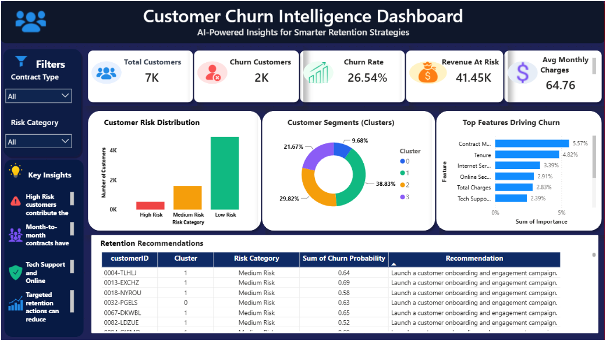
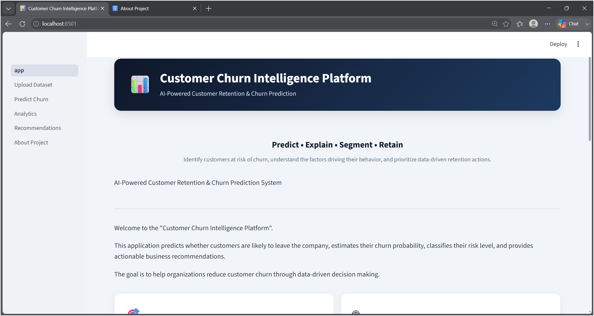
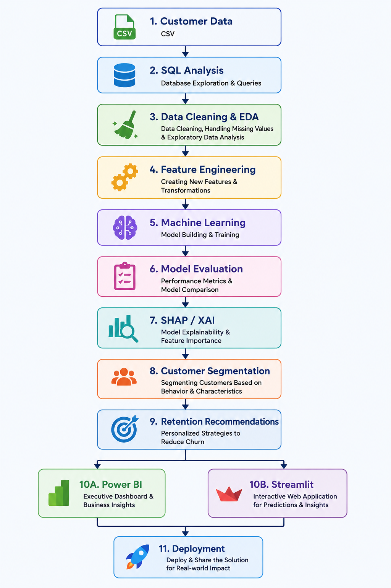
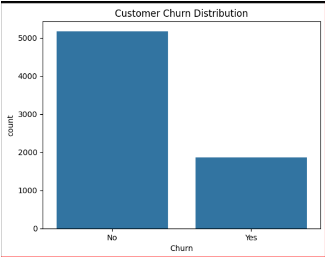
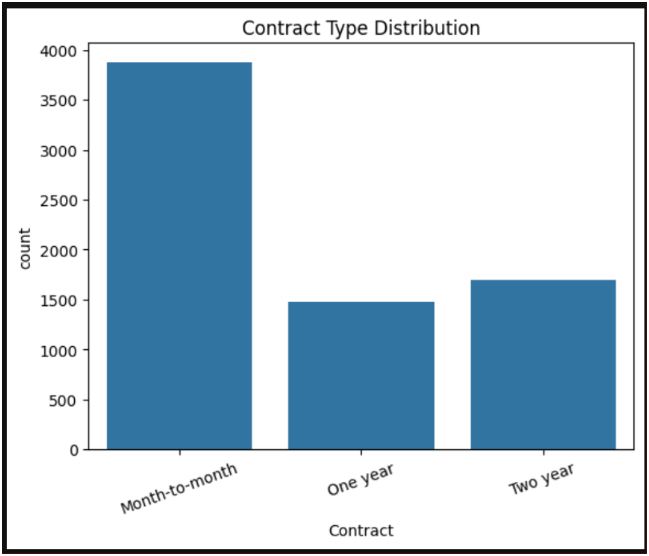
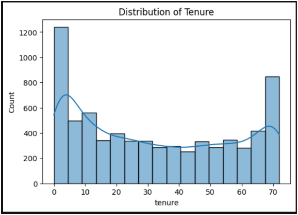

                   #  Customer Churn Intelligence Platform


### Predict • Explain • Segment • Recommend

<p align="center">

**An End-to-End Data Science Platform for Customer Churn Prediction, Explainability and Retention Intelligence**

</p>

<p align="center">

`Python` • `SQL` • `Machine Learning` • `SHAP` • `Power BI` • `Streamlit`

</p>

## 📸 Project Preview
<p align="center">
  
</p>

### Executive Power BI Dashboard


<p align="center">
  
</p>

### Streamlit Application


---

## 🎯 About the Project

Customer Churn Intelligence Platform is an end-to-end data science project built to identify customers who are likely to churn and understand the factors behind their risk.

The platform combines data analysis, machine learning, explainable AI, customer segmentation, retention recommendations, Power BI analytics, and a Streamlit application into one workflow.

Instead of only predicting whether a customer will churn, the project focuses on answering three business questions:

- **Who is likely to churn?**
- **Why are they likely to churn?**
- **What action can the business take to retain them?**

---

## 💼 Business Problem

Customer churn directly impacts recurring revenue and increases the cost of acquiring new customers. However, identifying churn only after a customer leaves does not give the business enough time to take action.

The challenge is to identify customers who are at risk of leaving **before churn happens**, understand the factors contributing to their risk, and convert those insights into practical retention actions.

### 🎯 Project Objective

The objective of this project is to build an end-to-end **Customer Churn Intelligence Platform** that can:

- Predict the likelihood of customer churn.
- Estimate each customer's churn probability and risk level.
- Explain the key factors influencing the prediction.
- Segment customers based on their characteristics and behavior.
- Generate actionable retention recommendations.
- Provide business-level insights through Power BI.
- Provide an interactive prediction and analytics interface through Streamlit.

## 🏗️ Project Architecture

The platform follows an end-to-end workflow that takes raw customer data through analysis, machine learning, explainability, segmentation, and business intelligence before delivering predictions and retention insights through Power BI and Streamlit.

<p align="center">
  
</p>


---

## 🔄 Project Development Workflow

The project was developed in a structured, phase-by-phase workflow, starting from business understanding and data analysis and progressing toward machine learning, explainability, business intelligence, application development, and deployment.

| Phase | Development Stage | Outcome |
|---|---|---|
| 01 | Business Understanding | Defined the churn problem and business objectives |
| 02 | Dataset Selection | Selected and understood the customer churn dataset |
| 03 | SQL Analysis | Performed customer and churn analysis using SQL |
| 04 | Data Cleaning | Handled missing values, data types, and inconsistencies |
| 05 | Exploratory Data Analysis | Identified churn patterns and important relationships |
| 06 | Feature Engineering | Prepared and transformed features for modeling |
| 07 | Machine Learning Pipeline | Built the reusable preprocessing and modeling pipeline |
| 08 | Model Evaluation | Compared models using classification and validation metrics |
| 09 | Explainable AI | Used SHAP to understand model predictions |
| 10 | Customer Segmentation | Grouped customers into meaningful segments |
| 11 | Recommendation Engine | Generated retention-focused recommendations |
| 12 | Executive Power BI Dashboard | Converted analysis into business-facing insights |
| 13 | Streamlit Application | Built an interactive customer churn intelligence interface |
| 14 | Deployment | Prepared the application and project for deployment |

> **Current status:** The complete end-to-end workflow has been implemented from raw customer data through prediction, explainability, business intelligence, application development, and deployment preparation.

---

## 🗄️ Dataset & SQL Analysis

### Dataset

The project uses a customer-level telecom churn dataset containing demographic information, account details, service information, contract details, and churn status.

Key information includes:

| Category | Examples |
|---|---|
| Customer Information | Customer ID, Gender, Senior Citizen, Partner, Dependents |
| Account Information | Tenure, Contract, Payment Method |
| Services | Phone Service, Internet Service |
| Financial Information | Monthly Charges, Total Charges |
| Target | Churn |

### SQL Analysis

SQL was used as an initial analytical layer before the machine learning workflow.

The analysis focused on understanding:

- Overall customer and churn counts
- Churn rate
- Churn across contract types
- Churn across payment methods
- Churn by internet service
- Customer tenure patterns
- Monthly and total charge patterns
- Customer characteristics associated with higher churn

This helped establish the business patterns that were later explored in greater detail through Python-based EDA and machine learning.

---
---

## 📊 Exploratory Data Analysis

EDA was performed to understand customer behavior, identify churn patterns, and determine which characteristics were associated with higher churn risk.

### Key Findings

- A significant portion of customers are classified as churned, highlighting the need for proactive retention.
- Month-to-month customers show higher churn compared with customers on longer-term contracts.
- Customer tenure shows a noticeable relationship with churn behavior, with newer customers generally requiring greater retention attention.

### Churn Distribution

<p align="center">
  
</p>

### Churn by Contract Type

<p align="center">
  
</p>

### Churn by Tenure

<p align="center">
  
</p>

---

## ⚙️ Feature Engineering

The raw customer data was transformed into a model-ready format while preserving the information required for churn prediction.

The feature engineering process included:

- Converting numerical fields such as `TotalCharges` into appropriate numeric formats.
- Handling missing and inconsistent values.
- Separating input features from the target variable `Churn`.
- Identifying numerical and categorical features.
- Encoding categorical variables for machine learning.
- Scaling numerical features where required.
- Building a reusable preprocessing pipeline to ensure the same transformations are applied during training and prediction.

### Feature Groups

| Feature Type | Examples | Processing |
|---|---|---|
| Numerical | `tenure`, `MonthlyCharges`, `TotalCharges` | Imputation / Scaling |
| Categorical | `Contract`, `InternetService`, `PaymentMethod` | Encoding |
| Target | `Churn` | Binary encoding |

The preprocessing workflow was integrated with the machine learning pipeline so that training and future customer predictions use the same feature transformations.


---

## 🤖 Machine Learning & Model Evaluation

After feature engineering, multiple classification algorithms were trained and evaluated to identify the model that provided the most reliable performance for customer churn prediction.

### Models Evaluated

The following models were compared:

- Logistic Regression
- Decision Tree
- Random Forest
- Gradient Boosting
- XGBoost

The models were evaluated using:

- Accuracy
- Precision
- Recall
- F1 Score
- ROC-AUC
- Cross-validation performance

 ### Model Comparison

The evaluated models were compared using multiple classification metrics rather than relying on accuracy alone.

| Model | Accuracy | Precision | Recall | F1 Score | ROC-AUC |
|---|---:|---:|---:|---:|---:|
| **Logistic Regression** | **82.11%** | **68.50%** | **60.05%** | **64.00%** | **86.21%** |
| Gradient Boosting | 80.77% | 67.47% | 52.82% | 59.25% | 85.96% |
| XGBoost | 78.85% | 62.38% | 50.67% | 55.92% | 84.32% |
| Random Forest | 79.70% | 66.29% | 47.45% | 55.31% | 83.48% |
| Decision Tree | 71.54% | 46.41% | 48.53% | 47.44% | 64.29% |

### Model Selection


Rather than selecting a model based on a single metric, the models were compared across multiple evaluation metrics and validation performance.

**Logistic Regression was selected as the final production model** because it provided the best overall balance of performance and generalization for this project.

It achieved the highest:

- Accuracy — **82.11%**
- Recall — **60.05%**
- F1 Score — **64.00%**
- ROC-AUC — **86.21%**

The selected model was then integrated with the preprocessing pipeline and saved for reuse in the Streamlit prediction application.

### Production Prediction Flow

```text
Customer Input
      ↓
Preprocessing Pipeline
      ↓
Feature Transformation
      ↓
Logistic Regression
      ↓
Churn Prediction
      ↓
Churn Probability
      ↓
Risk Classification

## 🔍 Explainable AI — SHAP

A churn prediction is more useful when the business can understand **why** a customer is considered at risk.

To make the model predictions interpretable, SHAP (SHapley Additive exPlanations) was implemented to identify the features contributing to individual churn predictions.


